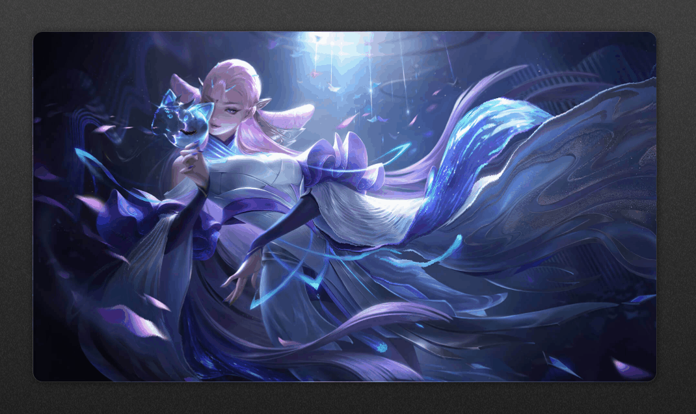
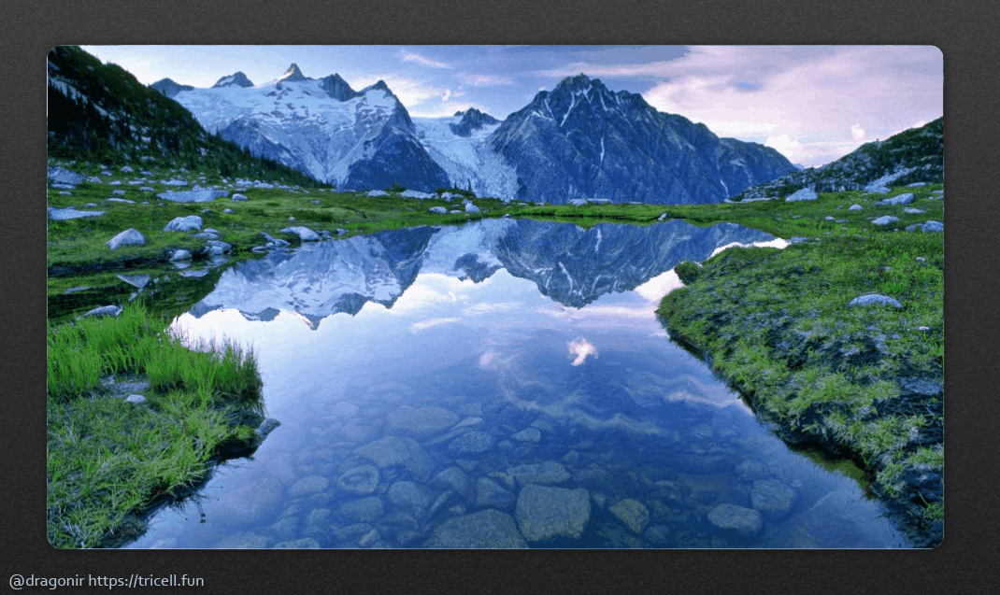
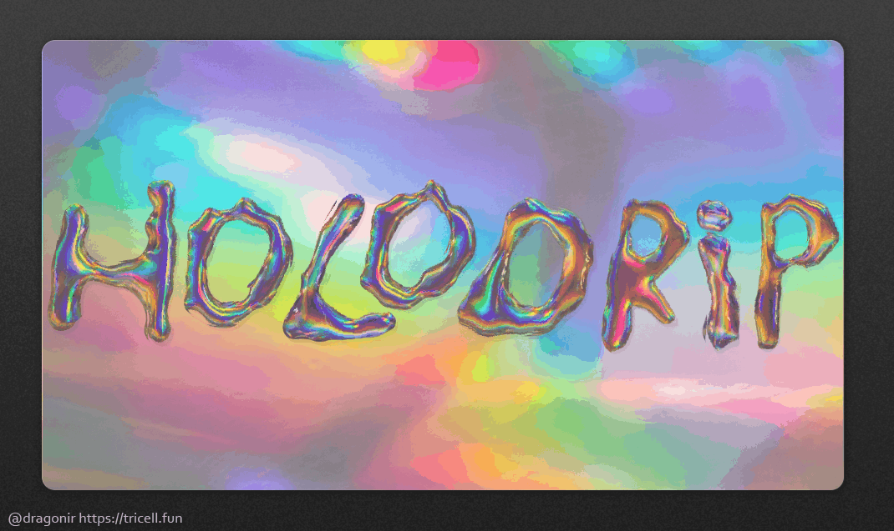
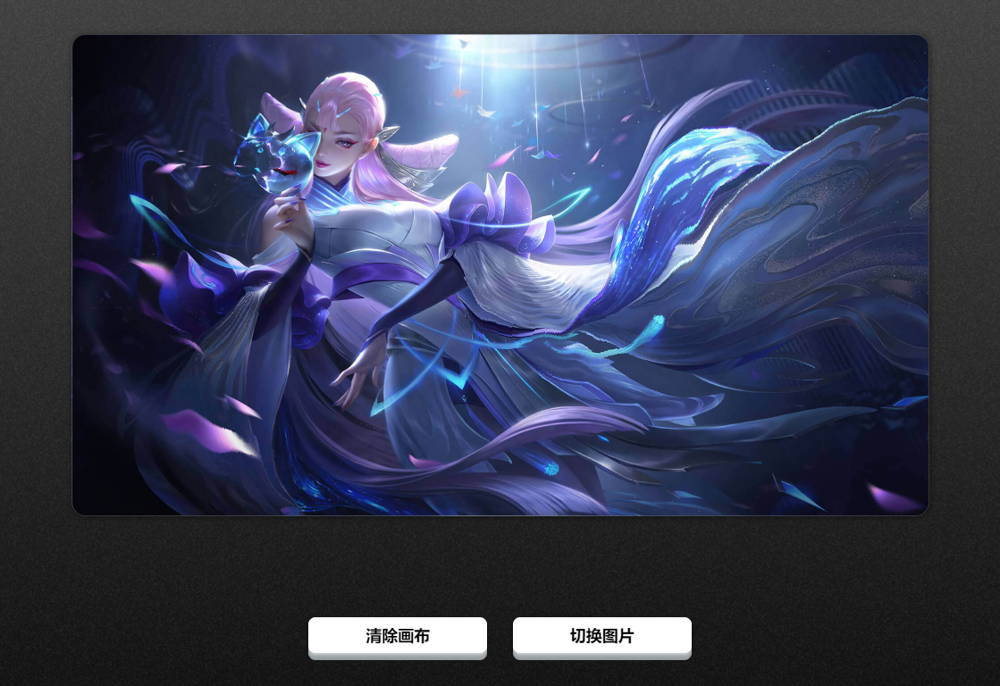
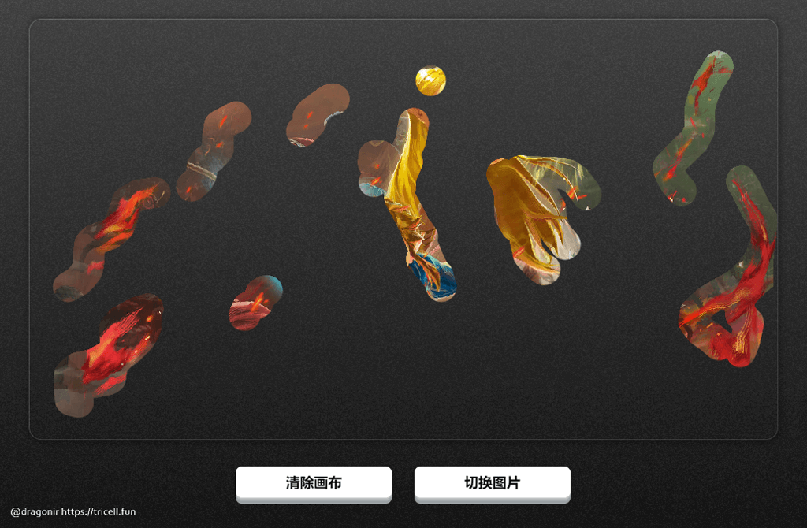
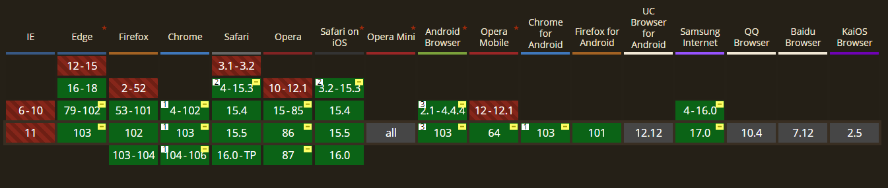

# 使用前端技术实现静态图片局部流动效果 🌊



> 声明：本文涉及图文和模型素材仅用于个人学习、研究和欣赏，请勿二次修改、非法传播、转载、出版、商用、及进行其他获利行为。

## 背景

如果你有玩过 `🎮` `《王者荣耀》`、`《阴阳师》` 等手游，一定注意到过它的启动动画、皮肤立绘卡片等场景，经常采用**静态底图加局部液态流动**效果的简单动画，这些流动动画可能出现在缓缓流动的水流 `🌊`、迎风飘动的旗帜 `🎏`、游戏角色衣袖 `🧜‍♀️`、随着时间缓动的云、雨、雾天气效果 `⛅` 等。这种过渡效果不仅节省了开发全量动画的成本，而且使得游戏画面更加热血、冒险、奥德赛、高级，也更加容易吸引玩家氪金 `💰`。

本文使用前端开发技术，结合 `SVG` 和  `CSS` 来实现类似的液化流动效果。本文包含的知识点主要包括：`mask-image` 遮罩、`feTurbulence` 和 `feDisplacementMap` 滤镜、`filter` 属性、`canvas` 绘制方法、`TimelineMax` 动画以及`input[type=file]` 本地图片资源加载等。

## 效果

先来看看实现效果，下面几个示例以及 `👆` 文章 `Banner` 图都是应用了由本文内容生成的液态流动动画效果。由于`GIF` 图压缩比较严重，动画效果看起来不是很流畅 `🙃`，大家不妨通过以下演示页面链接，亲自体验一下效果，生成自己的 `传说`、`典藏` 皮肤立绘吧 `😅`。

> `👁‍🗨` 在线体验：<https://dragonir.github.io/paint-heat-map/>

`🌀` **雾气扩散** `塞尔达传说：旷野之息`


`💃` **衣袖飘动** `貂蝉：猫影幻舞`


`🌅` **湖光波动**



`🔠` **文字液化**



> `📌` ps：体验页面部署在 `Gitpage` 上传图片功能不是真正上传到服务器，而是只会加载到浏览器本地，页面不会获取任何信息，大家可以放心体验，不用担心隐私泄漏问题。

## 实现

页面主要由 `2` 部分构成，顶部用于加载图片 ，并且可以通过按住 `🖱` 鼠标划动的方式绘制热点路径，给图片添加流动效果；底部是控制区域，点击按钮 `🔘` **清除画布**，可以清除绘制的流动动画效果、点击按钮 `🔘` **切换图片**可以加载本地的图片。



> `📌` 注意，还有一个隐形的功能，当你绘制完成时，可以点击 `🖱` **鼠标右键**，然后选择保存图片，保存的这张图片就是我们绘制流体动画路径的热点图，利用这张热点图，使用本文的 `CSS` 知识，就能把静态图片转化成动态图啦！

### HTML 页面结构

`#sketch` 元素主要是用于绘制和加载流动效果热点图的画板；`#button_container` 是页面底部的按钮控制区域；`svg` 元素用于利用其 `filter` 滤镜实现液态流动动画效果，包括 `feTurbulence` 和 `feDisplacementMap` 滤镜。

```html
<main id="sketch">
  <canvas id="canvas" data-img=""></canvas>
  <div class="mask">
    <div id="maskInner" class="mask-inner"></div>
  </div>
</main>
<section class="button_container">
  <button class="button">清除画布</button>
  <button class="button"><input class="input" type="file" id="upload">上传图片</button>
</section>
<svg>
  <filter id="heat" filterUnits="objectBoundingBox" x="0" y="0" width="100%" height="100%">
    <feTurbulence id="heatturb" type="fractalNoise" numOctaves="1" seed="2" />
    <feDisplacementMap xChannelSelector="G" yChannelSelector="B" scale="22" in="SourceGraphic" />
  </filter>
</svg>
```

#### `💡` feTurbulence 和 feDisplacementMap

* `feTurbulence`：滤镜利用 `Perlin` 噪声函数创建了一个图像，利用它可以实现人造纹理比如说云纹、大理石纹等模拟滤镜效果。
* `feDisplacementMap`：映射置换滤镜，该滤镜用来自图像中从 `in2` 到空间的像素值置换图像从 `in` 到空间的像素值。即它可以改变元素和图形的像素位置，通过遍历原图形的所有像素点，`feDisplacementMap` 重新映射替换一个新的位置，形成一个新的图形。该滤镜在业界的主流应用是对图形进行形变，扭曲，液化。

### CSS 样式

接着看看样式的实现，`main` 元素作为主容器并将主图案作为背景图片；`canvas` 作为画布占据 `100%` 的空间位置；`.mask` 和 `.mask-inner` 用于生成如下图所示热点路径与背景图相溶的效果，这种效果是借助 `mask-image` 实现的。最后，为了生成动态流动效果，`.mask-inner` 通过 `filter: url(#heat)` 将前面生成的 `svg` 作为滤镜来源，后续即将在 `JavaScript` 中通过不间断修改 `svg` 滤镜的属性，来生成液态流动动画。

```css
main {
  position: relative;
  background-image: url('bg.jpg');
  background-size: cover;
  background-position: 100% 50%;
}
canvas {
  opacity: 0;
  position: absolute;
  top: 0;
  left: 0;
  width: 100%;
  height: 100%;
}
.mask {
  display: none;
  position: absolute;
  top: 0;
  left: 0;
  width: 100%;
  height: 100%;
  mask-mode: luminance;
  mask-size: 100% 100%;
  backdrop-filter: hard-light;
  mask-image: url('mask.png');
}
.mask-inner {
  position: absolute;
  top: 0;
  left: 0;
  width: 100%;
  height: 100%;
  background: url('bg.jpg') 0% 0% repeat;
  background-size: cover;
  background-position: 100% 50%;
  filter: url(#heat);
  mask-image: url('mask.png')
}
```



#### `💡` mask-image

`mask-image` `CSS` 属性用于设置元素上遮罩层的图像。

**语法**：

```css
// 默认值，透明的黑色图像层，也就是没有遮罩层。
mask-image: none;
// <mask-source><mask>或CSS图像的url的值
mask-image: url(masks.svg#mask1);
// <image> 图片作为遮罩层
mask-image: linear-gradient(rgba(0, 0, 0, 1.0), transparent);
mask-image: image(url(mask.png), skyblue);
// 多个值
mask-image: image(url(mask.png), skyblue), linear-gradient(rgba(0, 0, 0, 1.0), transparent);
// 全局值
mask-image: inherit;
mask-image: initial;
mask-image: unset;
```

**兼容性**：



> `⚡` 此功能某些浏览器尚在开发中，需要使用浏览器前缀以兼容不同浏览器。

### JavaScript 方法

#### ① 绘制热点图

监听鼠标移动和点击事件，在 `canvas` 上绘制波动路径热点。

```js
var canvas = document.getElementById('canvas');
var ctx = canvas.getContext('2d');
var sketch = document.getElementById('sketch');
var sketchStyle = window.getComputedStyle(sketch);
var mouse = { x: 0, y: 0 };

canvas.width = parseInt(sketchStyle.getPropertyValue('width'));
canvas.height = parseInt(sketchStyle.getPropertyValue('height'));
canvas.addEventListener('mousemove', e => {
  mouse.x = e.pageX - canvas.getBoundingClientRect().left;
  mouse.y = e.pageY - canvas.getBoundingClientRect().top;
}, false);

ctx.lineWidth = 40;
ctx.lineJoin = 'round';
ctx.lineCap = 'round';
ctx.strokeStyle = 'black';

canvas.addEventListener('mousedown', () => {
  ctx.beginPath();
  ctx.moveTo(mouse.x, mouse.y);
  canvas.addEventListener('mousemove', onPaint, false);
}, false);

canvas.addEventListener('mouseup', () => {
  canvas.removeEventListener('mousemove', onPaint, false);
}, false);

var onPaint = () => {
  ctx.lineTo(mouse.x, mouse.y);
  ctx.stroke();
  var url = canvas.toDataURL();
  document.querySelectorAll('div').forEach(item => {
    item.style.cssText += `
      display: initial;
      -webkit-mask-image: url(${url});
      mask-image: url(${url});
    `;
  });
};
```

绘制完成后，可以在页面中**右键**保存生成的波动路径热点图，直接将绘制满意的热点图放到 `CSS` 中，就能给喜欢的图片添加局部波动效果了，下面这张图片就是本示例页面使用的波动的热点路径图。


#### ② 生成动画

为了生成实时更新的波动效果，本文使用了 `TweenMax` 来通过改变 `feTurbulence` 的 `baseFrequency` 属性值来实现，使用其他动画库或使用 `requestAnimationFrame` 也是可以实现相同的功能。

```js
feTurb = document.querySelector('#heatturb');
var timeline = new TimelineMax({
  repeat: -1,
  yoyo: true
}),
timeline.add(
  new TweenMax.to(feTurb, 8, {
    onUpdate: () => {
      var bfX = this.progress() * 0.01 + 0.025,
        bfY = this.progress() * 0.003 + 0.01,
        bfStr = bfX.toString() + ' ' + bfY.toString();
      feTurb.setAttribute('baseFrequency', bfStr);
    }
  }),
0);
```

#### ③ 清除画布

点击清除画布按钮，可以清空已经绘制的波动路径，主要是通过清除页面元素 `mask-image` 的属性值以及清 `canvas` 画布来实现的。

```js
function clear() {
  document.querySelectorAll('div').forEach(item => {
    item.style.cssText += `
      display: none;
      -webkit-mask-image: none;
      mask-image: none;
    `;
  });
}

document.querySelectorAll('.button').forEach(item => {
  item.addEventListener('click', () => {
    ctx.clearRect(0, 0, canvas.width, canvas.height);
    clear();
  })
});
```

#### ④ 切换图片

点击切换图片，可以加载本地的一张图片作为绘制底图，该功能是通过 `input[type=file]` 来实现图片资源的获取，然后通过修改 `CSS` 将它设置成新的画布背景。

```js
document.getElementById('upload').onchange = function () {
  var imageFile = this.files[0];
  var newImg = window.URL.createObjectURL(imageFile);
  clear();
  document.getElementById('sketch').style.cssText += `
    background: url(${newImg});
    background-size: cover;
    background-position: center;
  `;
  document.getElementById('maskInner').style.cssText += `
    background: url(${newImg});
    background-size: cover;
    background-position: center;
  `;
};
```

到这里，全部功能都实现完毕了，大家赶快制作一张自己喜欢的 `史诗皮肤` 或 `奥德赛小游戏` 的启动页面吧 `🤣`。


> `📥` 源码地址：[https://github.com/dragonir/paint-heat-map](https://github.com/dragonir/paint-heat-map)

## 总结

本文包含的新知识点主要包括：

* `mask-image` 遮罩元素
* `feTurbulence` 和 `feDisplacementMap` `svg`滤镜
* `filter` 属性
* `Canvas` 绘制方法
* `TimelineMax` 动画
* `input[type=file]` 本地图片资源加载

> 想了解其他前端知识或其他未在本文中详细描述的 `Web 3D` 开发技术相关知识，可阅读我往期的文章。**转载请注明原文地址和作者**。如果觉得文章对你有帮助，不要忘了**一键三连哦 👍**。

## 附录

* [我的3D专栏可以点击此链接访问 👈](https://juejin.cn/column/7049923956257587213)

* [1]. [🌐 使用Three.js实现炫酷的赛博朋克风格3D数字地球大屏](https://juejin.cn/post/7124116814937718797#comment)
* [2]. [🦊 Three.js 实现3D开放世界小游戏：阿狸的多元宇宙](https://juejin.cn/post/7081429595689320478)
* [3]. [🔥 Three.js 火焰效果实现艾尔登法环动态logo](https://juejin.cn/post/7077726955528781832)
* [4]. [🐼 Three.js 实现2022冬奥主题3D趣味页面，含冰墩墩](https://juejin.cn/post/7060292943608807460)
* `...`

* [1]. [📷 前端实现很哇塞的浏览器端扫码功能](https://juejin.cn/post/7018722520345870350)
* [2]. [🌏 前端瓦片地图加载之塞尔达传说旷野之息](https://juejin.cn/post/7007432493569671182)
* [3]. [😱 仅用CSS几步实现赛博朋克2077风格视觉效果](https://juejin.cn/post/6972759988632551460)
* `...`

## 参考

* [1]. [https://developer.mozilla.org/zh-CN/docs/Web/SVG/Element/feTurbulence](https://developer.mozilla.org/zh-CN/docs/Web/SVG/Element/feTurbulence)
* [2]. [https://developer.mozilla.org/zh-CN/docs/Web/SVG/Element/feDisplacementMap](https://developer.mozilla.org/zh-CN/docs/Web/SVG/Element/feDisplacementMap)
* [3]. [https://developer.mozilla.org/zh-CN/docs/Web/CSS/mask-image](https://developer.mozilla.org/zh-CN/docs/Web/CSS/mask-image)
* [4]. [https://developer.mozilla.org/zh-CN/docs/Web/CSS/filter](https://developer.mozilla.org/zh-CN/docs/Web/CSS/filter)
