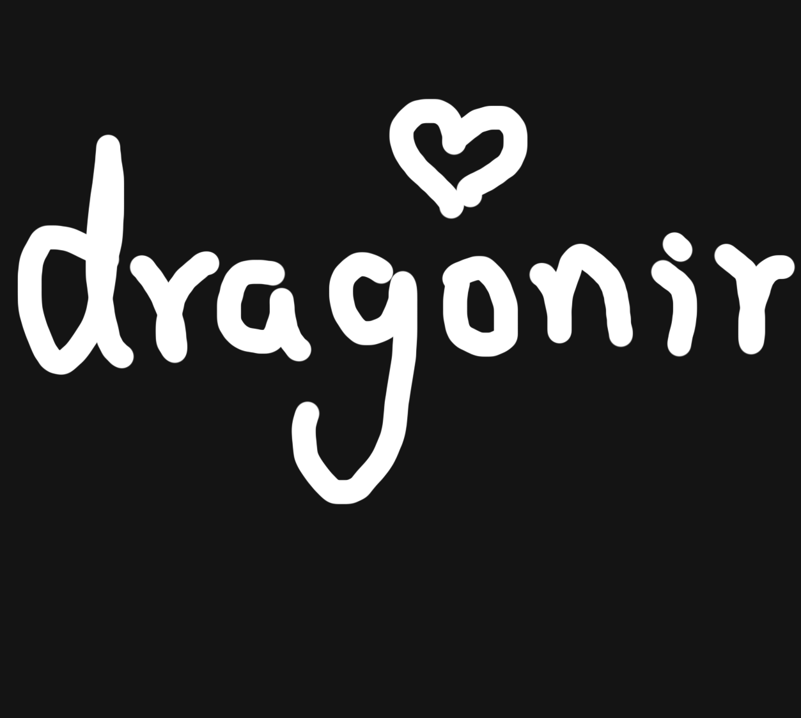
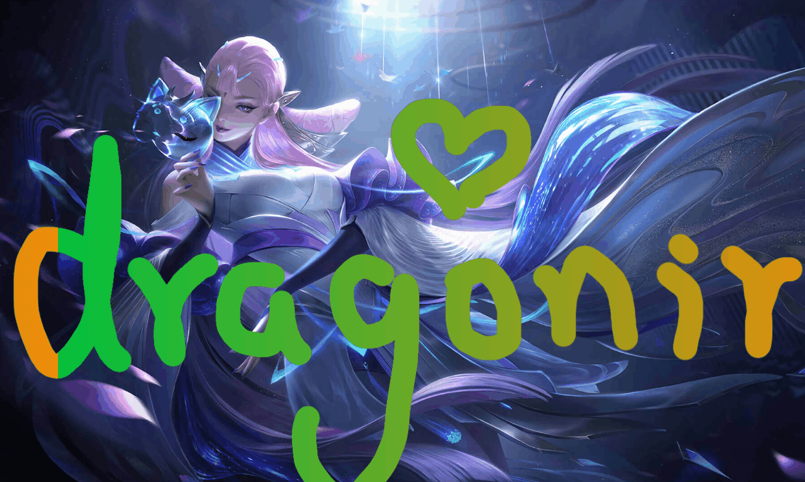

# 使用 mask-image 给静态图片添加动态效果


> 声明：本文涉及图文和模型素材仅用于个人学习、研究和欣赏，请勿二次修改、非法传播、转载、出版、商用、及进行其他获利行为。

## 背景

如Banner图貂蝉皮肤所示，如果你有玩过《王者荣耀》、《阴阳师》等手游，一定有注意到过，它的启动动画、皮肤卡片立绘等，经常看起来是一张静态的图片，但是局部有液态流动动画效果，如流动的水流、飘动的雾气、风、衣物等。本文使用前端开发技术，来实现类似的液化流动效果。

## 效果

下面几张图是使用本文内容生成的流动效果，gif图压缩比较严重效果不太好，大家可以打开示例链接，亲自上传图片体验效果。（ps：体验页面部署在Gitpage文中上传图片功能不是真正上传到服务器，而是只会加载到浏览器本地，页面不会获取任何信息，大家可以放心体验，不用担心隐私泄漏问题）

湖面波动


文字液化


岩浆沸腾


> `🎮` 在线体验：<https://dragonir.github.io/paint-heat-map/>

## 原理

### mask-image

`mask-image` `CSS` 属性用于设置元素上遮罩层的图像。

* 初始值：`none`
* 适用元素：所有元素，在 `SVG` 中它生效于除了 `defs` 元素和所有图形元素以外的所有容器元素
* 是否是继承属性：否
* 计算值：按照指定，但 `url` 值设为绝对值
* 动画类型：离散型

#### 语法

```css
/* 默认值，透明的黑色图像层，也就是没有遮罩层。 */
mask-image: none;
/* <mask-source><mask>或CSS图像的url的值 */
mask-image: url(masks.svg#mask1);
/* <image> 图片作为遮罩层 */
mask-image: linear-gradient(rgba(0, 0, 0, 1.0), transparent);
mask-image: image(url(mask.png), skyblue);
/* 多个值 */
mask-image: image(url(mask.png), skyblue), linear-gradient(rgba(0, 0, 0, 1.0), transparent);
/* 全局值 */
mask-image: inherit;
mask-image: initial;
mask-image: unset;
```


#### 例子

```css
#masked {
  width: 100px;
  height: 100px;
  background-color: #8cffa0;
  mask-image: url(https://mdn.mozillademos.org/files/12676/star.svg);
  -webkit-mask-image: url(https://mdn.mozillademos.org/files/12676/star.svg);
}
```

```html
<div id="masked"></div>
```

> `⚡` 此功能某些浏览器尚在开发中，需要使用浏览器前缀以兼容不同浏览器。

## 实现

页面主要由两部分构成，顶部用于加载图片，并且可以通过按住鼠标绘制的方式给图片添加流动效果；底部是控制区域，点击 `清除画布` 按钮，可以清除绘制的流动动画效果、点击 `切换图片` 可以加载本地的图片。`⚠⚠⚠` 注意，还有一个隐形的功能，当你绘制完成时，可以点击🖱鼠标右键，然后选择保存图片，保存的这张图片就是我们绘制流体动画路径的热点图，利用这张热点图，使用本文的CSS知识，就能把静态图片转化成动态图啦！


### 页面

feTurbulence
该滤镜利用 Perlin 噪声函数创建了一个图像。它实现了人造纹理比如说云纹、大理石纹的合成。

feDisplacementMap
映射置换滤镜，该滤镜用来自图像中从in2 (en-US)到空间的像素值置换图像从in到空间的像素值。

```html
<main id="sketch">
  <canvas id="canvas" data-img=""></canvas>
  <div class="mask">
    <div id="maskInner" class="mask-inner"></div>
  </div>
</main>
<section class="button_container">
  <button class="button">清除画布</button>
  <button class="button"><input class="input" type="file" id="upload">上传图片</button>
</section>
<svg xlmns="http://www.w3.org/2000/svg" version="1.1">
  <filter id="heat" filterUnits="objectBoundingBox" x="0" y="0" width="100%" height="100%">
    <feTurbulence id="heatturb" type="fractalNoise" numOctaves="1" seed="2" />
    <feDisplacementMap xChannelSelector="G" yChannelSelector="B" scale="22" in="SourceGraphic" />
  </filter>
</svg>
```

### 绘制

```js
var canvas = document.getElementById('canvas');
var ctx = canvas.getContext('2d');
var sketch = document.getElementById('sketch');
var sketchStyle = window.getComputedStyle(sketch);
var mouse = { x: 0, y: 0 };

canvas.width = parseInt(sketchStyle.getPropertyValue('width'));
canvas.height = parseInt(sketchStyle.getPropertyValue('height'));

canvas.addEventListener('mousemove', e => {
  mouse.x = e.pageX - canvas.getBoundingClientRect().left;
  mouse.y = e.pageY - canvas.getBoundingClientRect().top;
}, false);

ctx.lineWidth = 40;
ctx.lineJoin = 'round';
ctx.lineCap = 'round';
ctx.strokeStyle = 'black';

canvas.addEventListener('mousedown', () => {
  ctx.beginPath();
  ctx.moveTo(mouse.x, mouse.y);
  canvas.addEventListener('mousemove', onPaint, false);
}, false);

canvas.addEventListener('mouseup', () => {
  canvas.removeEventListener('mousemove', onPaint, false);
}, false);

var onPaint = () => {
  ctx.lineTo(mouse.x, mouse.y);
  ctx.stroke();
  var url = canvas.toDataURL();
  document.querySelectorAll('div').forEach(item => {
    item.style.cssText += `
      display: initial;
      -webkit-mask-image: url(${url});
      mask-image: url(${url});
    `;
  });
};

document.querySelectorAll('div').forEach(item => {
  item.style.cssText += `
    display: initial;
  `;
});

var timeline = new TimelineMax({
  repeat: -1,
  yoyo: true
}),
feTurb = document.querySelector('#heatturb');

timeline.add(
  new TweenMax.to(feTurb, 8, {
    onUpdate: function () {
      var bfX = this.progress() * 0.01 + 0.025,
        bfY = this.progress() * 0.003 + 0.01,
        bfStr = bfX.toString() + ' ' + bfY.toString();
      feTurb.setAttribute('baseFrequency', bfStr);
    }
  }),
0);


function clear() {
  document.querySelectorAll('div').forEach(item => {
    item.style.cssText += `
      display: none;
      -webkit-mask-image: none;
      mask-image: none;
    `;
  });
}

document.querySelectorAll('.button').forEach(item => {
  item.addEventListener('click', () => {
    ctx.clearRect(0, 0, canvas.width, canvas.height);
    clear();
  })
});

document.getElementById('upload').onchange = function () {
  var imageFile = this.files[0];
  var newImg = window.URL.createObjectURL(imageFile);
  clear();
  document.getElementById('sketch').style.cssText += `
    background: url(${newImg});
    background-size: cover;
    background-position: center;
  `;
  document.getElementById('maskInner').style.cssText += `
    background: url(${newImg});
    background-size: cover;
    background-position: center;
  `;
};
```

### 样式

```css
main {
  cursor: -webkit-grab;
  cursor: grab;
  width: 960px;
  height: 540px;
  flex-shrink: 0;
  background-image: url('../images/bg.jpg');
  background-size: cover;
  background-position: 100% 50%;
  position: relative;
  border-radius: 16px;
  overflow: hidden;
  box-shadow: 1px 1px 10px rgba(0, 0, 0, .5);
  border: 1px groove rgba(255, 255, 255, .2);
}
canvas {
  opacity: 0;
  position: absolute;
  top: 0;
  left: 0;
  width: 100%;
  height: 100%;
}
.mask {
  display: none;
  position: absolute;
  top: 0;
  left: 0;
  width: 100%;
  height: 100%;
  pointer-events: none;
  mask-mode: luminance;
  -webkit-mask-size: 100% 100%;
          mask-size: 100% 100%;
  -webkit-backdrop-filter: hard-light;
          backdrop-filter: hard-light;
  -webkit-mask-image: url('../images/mask.png');
  mask-image: url('../images/mask.png');
}
.mask-inner {
  position: absolute;
  top: 0;
  left: 0;
  width: 100%;
  height: 100%;
  background: url('../images/bg.jpg') 0% 0% repeat;
  background-size: cover;
  background-position: 100% 50%;
  filter: url(#heat);
  -webkit-mask-image: url('../images/mask.png');
  mask-image: url('../images/mask.png')
}
```

## 更多示例

### example 0

Say you had an element with a photographic background, and a black-and-white SVG graphic to use as a mask, like this:


You could set the image as a background-image and the mask as a mask-image on the same element, and get something like this:

```html
<div class="el"></div>
```

```css
body {
  margin: 0;
  background: #a8ff78;
  background: -webkit-linear-gradient(to right, #78ffd6, #a8ff78);
  background: linear-gradient(to right, #78ffd6, #a8ff78);
}
.el {
  width: 100vw;
  height: 100vh;
  padding: 1rem;
  background-image: url('../assets/images/bg.jpg');
  background-size: cover;
  background-position: center;
  background-repeat: no-repeat;
  -webkit-mask-image: url('../assets/images/sun.svg');
  -webkit-mask-size: 100vmin;
  -webkit-mask-repeat: no-repeat;
  -webkit-mask-position: center;
  mask-image: url('../assets/images/sun.svg');
  mask-size: 100vmin;
  mask-repeat: no-repeat;
  mask-position: center;
}
```


That works because the top of the linear-gradient is transparent. I would have assumed it would work if it was white as well as long as the mask-type was luminance, but that doesn’t seem to work in any browser for me.

Speaking of luminance masks, that doesn’t seem to work for images-as-masks that are a raster format like JPG or PNG for me. Update: Reader Micheal Hall writes in with a demo where it might have something to do with using the long-hand properties. Firefox seems to support this concept if you only use the shorthand.

But alpha masks seem to work just fine. As in raster graphics that use actual alpha transparency. Like this:

#### example 1



```html
<div class="el"></div>
```

```css
body {
  margin: 0;
  background: #f08c0a;
  background: -webkit-linear-gradient(to right, #03c03c, #f08c0a);
  background: linear-gradient(to right, #03c03c, #f08c0a);
  background-position-x: 0;
  animation: size 2s infinite ease-in-out;
}
@keyframes size {
  to {
    background-position-x: 100vw;
  }
}
.el {
  width: 100vw;
  height: 100vh;
  background-image: url('../assets/images/bg.jpg');
  background-size: cover;
  background-position: center;
  -webkit-mask-image: url('../assets/images/dragonir.png');
  -webkit-mask-size: cover;
  mask-image: url('../assets/images/dragonir.png');
  mask-size: cover;
}
```



#### example 2

The mask-image property can also be used directly inside SVG elements. Like check out this elliptical mask that also has a blurred filter:

```html
<svg xmlns="http://www.w3.org/2000/svg" xmlns:xlink="http://www.w3.org/1999/xlink" width="170" height="200">
  <defs>
    <filter id="filter">
      <feGaussianBlur stdDeviation="5" />
    </filter>
    <mask id="mask">
      <ellipse cx="50%" cy="50%" rx="25%" ry="25%" fill="white" filter="url(#filter)"></ellipse>
    </mask>
  </defs>
  <image xlink:href="https://s3-us-west-2.amazonaws.com/s.cdpn.io/3/Harry-Potter-1-.jpg" width="170" height="200" mask="url(#mask)"></image>
</svg>
```

It kinda looks like you could snag that SVG mask and apply it to other elements with mask-image: url(#mask); but I don’t find that actually works. It only works within SVG, and has a nasty side effect of entirely erasing an image if used outside the SVG.


We covered the use of the clip-path property for clipping using CSS, so it’s only natural that we now go over masking. Contrary to clipping, where a part of an image or element is either completely invisible or completely visible, with masking we can hide or show parts of an image with different levels of opacity.

Masking in CSS is done using the mask-image property, and an image has to be provided as the mask. Anything that’s 100% black in the image mask with be completely visible, anything that’s 100% transparent will be completely hidden, and anything in-between will partially mask the image. Linear and radial gradients in CSS are generated images, so they can be used as the image mask. SVGs that use the mask element can also be used as the image mask. Let’s go over the 3 possibilities for image masks with concrete examples:

Masking Using Gradients
Let’s first use a simple linear gradient that goes from transparent to black. The first image is our default starting image, and the second image has our linear gradient applied as the mask-image value:


Here’s the CSS rules used here:

```css
.mask1 {
  -webkit-mask-image: linear-gradient(to bottom, transparent 25%, black 75%);
  mask-image: linear-gradient(to bottom, transparent 25%, black 75%);
}
```

Here are two more examples of interesting effects that can be accomplished with masking using gradients:


And the CSS rules for these 2 gradient masks:

```css
.mask2 {
  -webkit-mask-image: radial-gradient(circle at 50% 60%, black 50%, rgba(0, 0, 0, 0.6) 50%);
  mask-image: radial-gradient(circle at 50% 60%, black 50%, rgba(0, 0, 0, 0.6) 50%);
}
.mask3 {
  -webkit-mask-image: radial-gradient(ellipse 90% 80% at 48% 78%, black 40%, transparent 50%);
  mask-image: radial-gradient(ellipse 90% 80% at 48% 78%, black 40%, transparent 50%);
}
```

##### Masking Using Images

Here’s we’re using an image that was created using Sketch as our image mask. The first image is the image mask itself, and the second image has that mask applied to it:


And our CSS looks like this:

```css
.mask4 {
  -webkit-mask-image: url("/path/to/image-mask.png");
  mask-image: url("/path/to/image-mask.png");
  -webkit-mask-size: 400px 600px;
  mask-size: 400px 600px;
}
```

We specified a value for mask-size here because our image mask is 800px by 1200px, but here we want everything shrunk by half so that the image can look sharp on retina displays.

##### Masking Using SVG Masks

Finally, if SVG is your groove, you can define image masks using the SVG mask element.

The first example currently only seems to be working in Firefox (you probably won’t see anything in non-supporting browsers). It defines the SVG mask and then we reference the ID of the mask in CSS as usual. The second example seems to have wider support and defines the image as part of the SVG element itself.

> Also note that with SVG masks, the colors to use are white and black instead of transparent and black. The colors also work in reverse and white/partially white is what will be visible.


Example 1 (triangle)
Here’s the SVG markup for the first example:

```html
<svg width="0" height="0" viewBox="0 0 400 600">
  <defs>
    <mask id="my-svg-mask">
      <rect fill="#000000" x="0" y="0" width="400" height="600"></rect>
      <polygon fill="#FFFFFF" points="200.5 152 349 449 52 449"></polygon>
    </mask>
  </defs>
</svg>
```

Then we can apply the mask to our image with mask-image as usual by refecencing the ID of the SVG mask:

```css
.mask5 {
  -webkit-mask-image: url(#my-svg-mask);
  mask-image: url(#my-svg-mask);
}
```

Example 2 (bubbles)
For our second SVG example, everything is contained in the SVG definition, including our main image itself:

```html
<svg width="400px" height="600px" viewBox="0 0 400 600">
  <defs>
    <mask id="my-svg-mask2">
      <rect id="Rectangle" fill="#000000" x="0" y="0" width="400" height="600"></rect>
      <circle id="Oval" fill="#FFFFFF" cx="67.5" cy="51.5" r="67.5"></circle>
      <circle id="Oval" fill="#FFFFFF" cx="296.597656" cy="118.597656" r="56.5976562"></circle>
      <circle id="Oval" fill="#FFFFFF" cx="53.4648437" cy="256.464844" r="81.4648437"></circle>
      <circle id="Oval" fill="#FFFFFF" cx="239.587891" cy="313.587891" r="70.5878906"></circle>
      <circle id="Oval" fill="#FFFFFF" cx="366.597656" cy="562.597656" r="56.5976562"></circle>
      <circle id="Oval" fill="#FFFFFF" cx="93.203125" cy="486.203125" r="76.203125"></circle>
    </mask>
  </defs>
  <image mask="url(#my-svg-mask2)" xmlns:xlink="http://www.w3.org/1999/xlink" xlink:href="/images/css/masking/masking-example1.jpg" width="400" height="600"></image>
</svg>
```

## 参考资料

* [1]. <https://developer.mozilla.org/zh-CN/docs/Web/CSS/mask-image>
* [2]. <https://css-tricks.com/almanac/properties/m/mask-image/>
* [3]. <https://www.digitalocean.com/community/tutorials/css-masking-with-mask-image>
https://developer.mozilla.org/zh-CN/docs/Web/SVG/Element/feDisplacementMap
