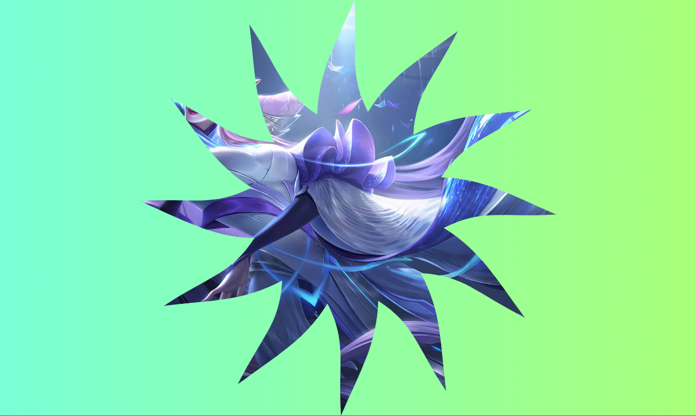
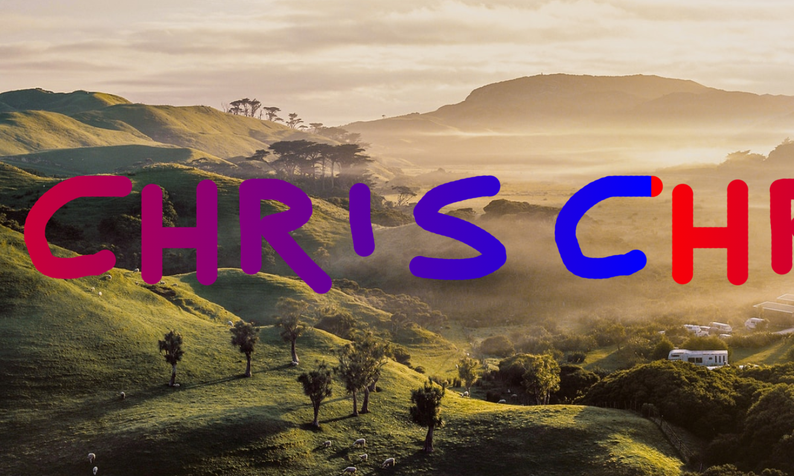
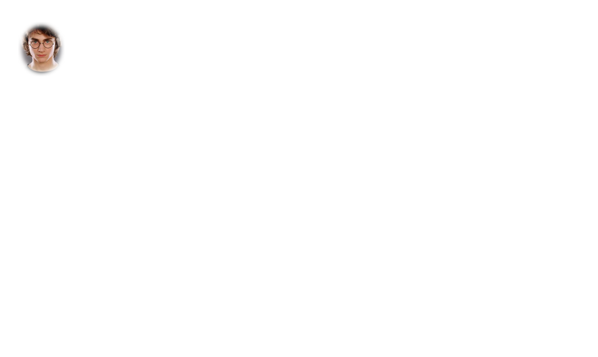
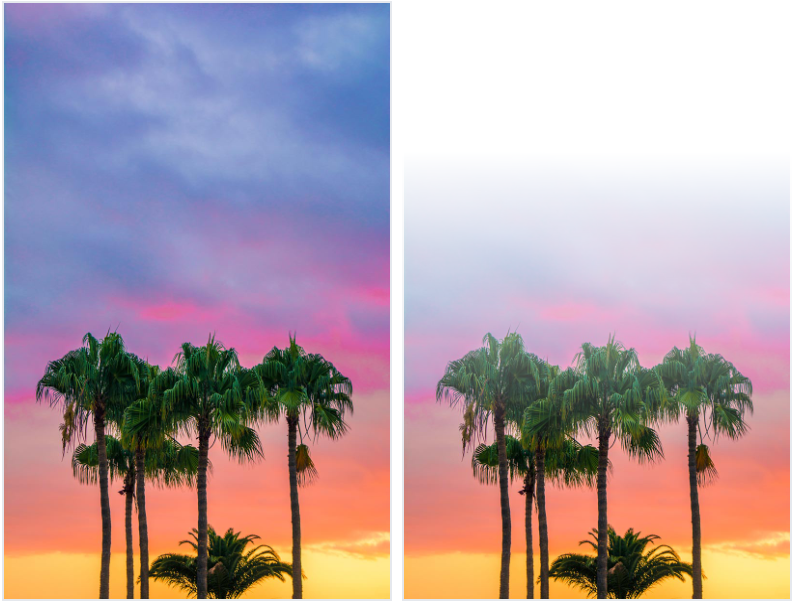
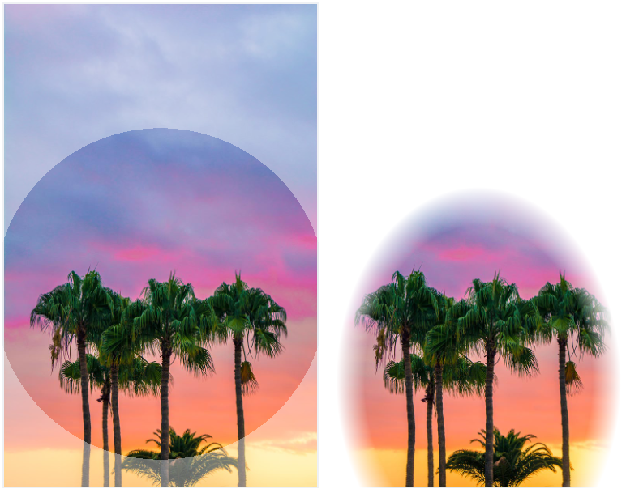
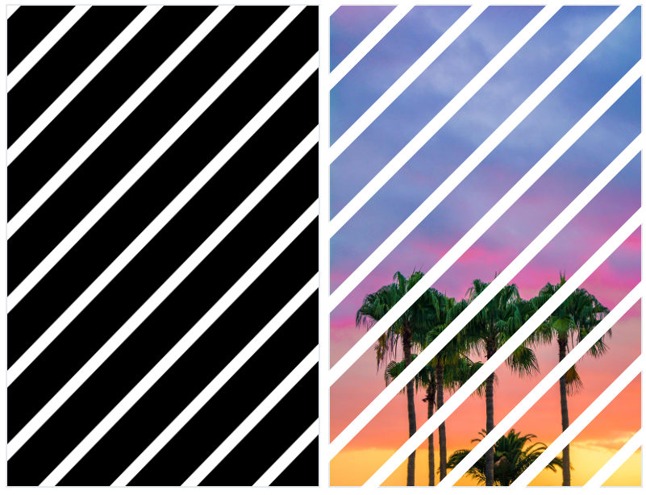
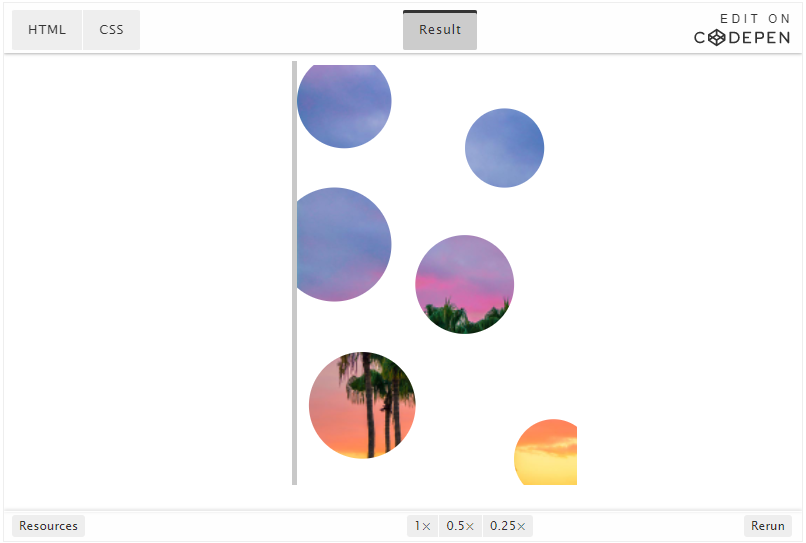

# 使用mask-image实现游戏卡片波动效果


## 背景

## 效果

在线预览：<https://dragonir.github.io/paint-heat-map/>

## 原理

```
mask-image
Experimental: 这是一个实验中的功能
此功能某些浏览器尚在开发中，请参考浏览器兼容性表格以得到在不同浏览器中适合使用的前缀。由于该功能对应的标准文档可能被重新修订，所以在未来版本的浏览器中该功能的语法和行为可能随之改变。

概要
mask-image CSS属性用于设置元素上遮罩层的图像。

初始值	none
适用元素	all elements; In SVG, it applies to container elements excluding the defs element and all graphics elements
是否是继承属性	否
计算值	as specified, but with url values made absolute
Animation type	discrete
语法
/* Keyword value */
mask-image: none;

/* <mask-source> value */
mask-image: url(masks.svg#mask1);

/* <image< values */
mask-image: linear-gradient(rgba(0, 0, 0, 1.0), transparent);
mask-image: image(url(mask.png), skyblue);

/* Multiple values */
mask-image: image(url(mask.png), skyblue), linear-gradient(rgba(0, 0, 0, 1.0), transparent);

/* Global values */
mask-image: inherit;
mask-image: initial;
mask-image: unset;
Copy to Clipboard
Values
none
默认值，透明的黑色图像层，也就是没有遮罩层。
<mask-source>
<mask>或CSS图像的url
<image>
图片作为遮罩层
Formal syntax
<mask-reference>#
where 
<mask-reference> = none | <image> | <mask-source>

where 
<image> = <url> | <image()> | <image-set()> | <element()> | <paint()> | <cross-fade()> | <gradient>
<mask-source> = <url>

where 
<image()> = image( <image-tags>? [ <image-src>? , <color>? ]! )
<image-set()> = image-set( <image-set-option># )
<element()> = element( <id-selector> )
<paint()> = paint( <ident> (en-US), <declaration-value>? )
<cross-fade()> = cross-fade( <cf-mixing-image> , <cf-final-image>? )
<gradient> = <linear-gradient()> | <repeating-linear-gradient()> | <radial-gradient()> | <repeating-radial-gradient()> | <conic-gradient()>

where 
<image-tags> = ltr | rtl
<image-src> = <url> | <string>
<color> = <rgb()> | <rgba()> | <hsl()> | <hsla()> | <hwb()> | <hex-color> | <named-color> | currentcolor | <deprecated-system-color>
<image-set-option> = [ <image> | <string> ] [ <resolution> || type(<string>) ]
<id-selector> = <hash-token>
<cf-mixing-image> = <percentage>? && <image>
<cf-final-image> = <image> | <color>
<linear-gradient()> = linear-gradient( [ <angle> | to <side-or-corner> ]? , <color-stop-list> )
<repeating-linear-gradient()> = repeating-linear-gradient( [ <angle> | to <side-or-corner> ]? , <color-stop-list> )
<radial-gradient()> = radial-gradient( [ <ending-shape> || <size> ]? [ at <position> ]? , <color-stop-list> )
<repeating-radial-gradient()> = repeating-radial-gradient( [ <ending-shape> || <size> ]? [ at <position> ]? , <color-stop-list> )
<conic-gradient()> = conic-gradient( [ from <angle> ]? [ at <position> ]?, <angular-color-stop-list> )

where 
<rgb()> = rgb( <percentage>{3} [ / <alpha-value> ]? ) | rgb( <number>{3} [ / <alpha-value> ]? ) | rgb( <percentage>#{3} , <alpha-value>? ) | rgb( <number>#{3} , <alpha-value>? )
<rgba()> = rgba( <percentage>{3} [ / <alpha-value> ]? ) | rgba( <number>{3} [ / <alpha-value> ]? ) | rgba( <percentage>#{3} , <alpha-value>? ) | rgba( <number>#{3} , <alpha-value>? )
<hsl()> = hsl( <hue> <percentage> <percentage> [ / <alpha-value> ]? ) | hsl( <hue>, <percentage>, <percentage>, <alpha-value>? )
<hsla()> = hsla( <hue> <percentage> <percentage> [ / <alpha-value> ]? ) | hsla( <hue>, <percentage>, <percentage>, <alpha-value>? )
<hwb()> = hwb( [<hue> | none] [<percentage> | none] [<percentage> | none] [ / [<alpha-value> | none] ]? )
<side-or-corner> = [ left | right ] || [ top | bottom ]
<color-stop-list> = [ <linear-color-stop> [, <linear-color-hint>]? ]# , <linear-color-stop>
<ending-shape> = circle | ellipse
<size> = closest-side | farthest-side | closest-corner | farthest-corner | <length> | <length-percentage>{2}
<position> = [ [ left | center | right ] || [ top | center | bottom ] | [ left | center | right | <length-percentage> ] [ top | center | bottom | <length-percentage> ]? | [ [ left | right ] <length-percentage> ] && [ [ top | bottom ] <length-percentage> ] ]
<angular-color-stop-list> = [ <angular-color-stop> [, <angular-color-hint>]? ]# , <angular-color-stop>

where 
<alpha-value> = <number> | <percentage>
<hue> = <number> | <angle>
<linear-color-stop> = <color> <color-stop-length>?
<linear-color-hint> = <length-percentage>
<length-percentage> = <length> | <percentage>
<angular-color-stop> = <color> && <color-stop-angle>?
<angular-color-hint> = <angle-percentage>

where 
<color-stop-length> = <length-percentage>{1,2}
<color-stop-angle> = <angle-percentage>{1,2}
<angle-percentage> = <angle> | <percentage>

例子
CSS
#masked {
  width: 100px;
  height: 100px;
  background-color: #8cffa0;
  mask-image: url(https://mdn.mozillademos.org/files/12676/star.svg);
  -webkit-mask-image: url(https://mdn.mozillademos.org/files/12676/star.svg);
}
Copy to Clipboard
HTML
<div id="masked"></div>
```

## 实现

绘制热力图

### 页面

```html
<main id="sketch">
	<canvas id="canvas" data-img=""></canvas>
	<div class="mask">
    <div id="maskInner" class="mask-inner"></div>
  </div>
</main>
<section class="button_container">
  <button class="button">清除画布</button>
  <button class="button"><input class="input" type="file" id="upload">上传图片</button>
</section>
<svg xlmns="http://www.w3.org/2000/svg" version="1.1">
  <filter id="heat" filterUnits="objectBoundingBox" x="0" y="0" width="100%" height="100%">
    <feTurbulence id="heatturb" type="fractalNoise" numOctaves="1" seed="2" />
    <feDisplacementMap xChannelSelector="G" yChannelSelector="B" scale="22" in="SourceGraphic" />
  </filter>
</svg>
```

### 绘制

```js
var canvas = document.getElementById('canvas');
var ctx = canvas.getContext('2d');
var sketch = document.getElementById('sketch');
var sketchStyle = window.getComputedStyle(sketch);
var mouse = { x: 0, y: 0 };

canvas.width = parseInt(sketchStyle.getPropertyValue('width'));
canvas.height = parseInt(sketchStyle.getPropertyValue('height'));

canvas.addEventListener('mousemove', e => {
  mouse.x = e.pageX - canvas.getBoundingClientRect().left;
  mouse.y = e.pageY - canvas.getBoundingClientRect().top;
}, false);

ctx.lineWidth = 40;
ctx.lineJoin = 'round';
ctx.lineCap = 'round';
ctx.strokeStyle = 'black';

canvas.addEventListener('mousedown', () => {
  ctx.beginPath();
  ctx.moveTo(mouse.x, mouse.y);
  canvas.addEventListener('mousemove', onPaint, false);
}, false);

canvas.addEventListener('mouseup', () => {
  canvas.removeEventListener('mousemove', onPaint, false);
}, false);

var onPaint = () => {
  ctx.lineTo(mouse.x, mouse.y);
  ctx.stroke();
  var url = canvas.toDataURL();
  document.querySelectorAll('div').forEach(item => {
    item.style.cssText += `
      display: initial;
      -webkit-mask-image: url(${url});
      mask-image: url(${url});
    `;
  });
};

document.querySelectorAll('div').forEach(item => {
  item.style.cssText += `
    display: initial;
  `;
});

var timeline = new TimelineMax({
  repeat: -1,
  yoyo: true
}),
feTurb = document.querySelector('#heatturb');

timeline.add(
  new TweenMax.to(feTurb, 8, {
    onUpdate: function () {
      var bfX = this.progress() * 0.01 + 0.025,
        bfY = this.progress() * 0.003 + 0.01,
        bfStr = bfX.toString() + ' ' + bfY.toString();
      feTurb.setAttribute('baseFrequency', bfStr);
    }
  }),
0);


function clear() {
  document.querySelectorAll('div').forEach(item => {
    item.style.cssText += `
      display: none;
      -webkit-mask-image: none;
      mask-image: none;
    `;
  });
}

document.querySelectorAll('.button').forEach(item => {
  item.addEventListener('click', () => {
    ctx.clearRect(0, 0, canvas.width, canvas.height);
    clear();
  })
});

document.getElementById('upload').onchange = function () {
  var imageFile = this.files[0];
  var newImg = window.URL.createObjectURL(imageFile);
  clear();
  document.getElementById('sketch').style.cssText += `
    background: url(${newImg});
    background-size: cover;
    background-position: center;
  `;
  document.getElementById('maskInner').style.cssText += `
    background: url(${newImg});
    background-size: cover;
    background-position: center;
  `;
};
```

### 样式

```css
* {
  box-sizing: border-box;
  margin: 0;
  padding: 0;
  -webkit-user-select: none;
  -moz-user-select: none;
  -ms-user-select: none;
  user-select: none;
}

body, html {
  height: 100%;
  overflow: hidden;
}

body {
  display: flex;
  flex-direction: column;
  align-items: center;
  justify-content: center;
  background: #232526;
  background: -webkit-linear-gradient(to right, #414345, #232526);
  background: linear-gradient(to right, #414345, #232526);
}

main {
  cursor: -webkit-grab;
  cursor: grab;
  width: 960px;
  height: 540px;
  flex-shrink: 0;
  background-image: url('../images/bg.jpg');
  background-size: cover;
  background-position: 100% 50%;
  position: relative;
  border-radius: 16px;
  overflow: hidden;
  box-shadow: 1px 1px 10px rgba(0, 0, 0, .5);
  border: 1px groove rgba(255, 255, 255, .2);
}

canvas {
  opacity: 0;
  position: absolute;
  top: 0;
  left: 0;
  width: 100%;
  height: 100%;
}

.mask {
  display: none;
  position: absolute;
  top: 0;
  left: 0;
  width: 100%;
  height: 100%;
  pointer-events: none;
  mask-mode: luminance;
  -webkit-mask-size: 100% 100%;
          mask-size: 100% 100%;
  -webkit-backdrop-filter: hard-light;
          backdrop-filter: hard-light;
  -webkit-mask-image: url('../images/mask.png');
  mask-image: url('../images/mask.png');
}

.mask-inner {
  position: absolute;
  top: 0;
  left: 0;
  width: 100%;
  height: 100%;
  background: url('../images/bg.jpg') 0% 0% repeat;
  background-size: cover;
  background-position: 100% 50%;
  filter: url(#heat);
  -webkit-mask-image: url('../images/mask.png');
  mask-image: url('../images/mask.png')
}

.button_container {
  margin: 40px auto;
  position: fixed;
  bottom: 0;
}

.button {
  height: 40px;
  width: 200px;
  position: relative;
  -webkit-font-smoothing: antialiased;
  background: #a8ff78;
  background: -webkit-linear-gradient(to right, #78ffd6, #a8ff78);
  background: linear-gradient(to right, #78ffd6, #a8ff78);
  border-radius: 12px;
  border: none;
  outline: none;
  -webkit-appearance: none;
  color: rgb(59, 90, 65);
  border-radius: 20px;
  text-align: center;
  font-size: 18px;
  text-decoration: none;
  cursor: pointer;
  overflow: hidden;
  box-shadow: 0 1px 0 hsl(200,5%,80%),
              0 2px 0 hsl(200,5%,75%),
              0 3px 0 hsl(200,5%,70%),
              0 4px 0 hsl(200,5%,66%),
              0 5px 0 hsl(200,5%,64%),
              0 6px 0 hsl(200,5%,62%),
              0 7px 0 hsl(200,5%,61%),
              0 8px 0 hsl(200,5%,60%),
              0 0 5px rgba(0,0,0,.05),
            0 1px 3px rgba(0,0,0,.2),
            0 3px 5px rgba(0,0,0,.2),
            0 5px 8px rgba(0,0,0,.2);
}
.button:hover {
  background: #48df69;
}
.button:first-child {
  margin-right: 24px;
}
.button .input {
  position: absolute;
  left: 0;
  top: 0;
  -webkit-appearance: none;
  display: inline-block;
  height: 100%;
  width: 100%;
  background: transparent;
  opacity: 0;
  cursor: pointer;
}
```

## 更多示例

A mask in CSS hides part of the element is applied to.

.element {
  mask-image: url(star.svg);
}
Say you had an element with a photographic background, and a black-and-white SVG graphic to use as a mask, like this:


You could set the image as a background-image and the mask as a mask-image on the same element, and get something like this:

#### example 0

```html
<!DOCTYPE html>
<html lang="en">
<head>
  <meta charset="UTF-8">
  <meta http-equiv="X-UA-Compatible" content="IE=edge">
  <meta name="viewport" content="width=device-width, initial-scale=1.0">
  <title>Document</title>
  <style>
    * {
      box-sizing: border-box;
    }
    body {
      margin: 0;
      background: #a8ff78;
      background: -webkit-linear-gradient(to right, #78ffd6, #a8ff78);
      background: linear-gradient(to right, #78ffd6, #a8ff78);
    }
    .el {
      width: 100vw;
      height: 100vh;
      padding: 1rem;
      background-image: url('../assets/images/bg.jpg');
      background-size: cover;
      background-position: center;
      background-repeat: no-repeat;
      -webkit-mask-image: url('../assets/images/sun.svg');
      -webkit-mask-size: 100vmin;
      -webkit-mask-repeat: no-repeat;
      -webkit-mask-position: center;
      mask-image: url('../assets/images/sun.svg');
      mask-size: 100vmin;
      mask-repeat: no-repeat;
      mask-position: center;
    }
  </style>
</head>
<body>
  <div class="el"></div>
</body>
</html>
```



That works because the top of the linear-gradient is transparent. I would have assumed it would work if it was white as well as long as the mask-type was luminance, but that doesn’t seem to work in any browser for me.

Speaking of luminance masks, that doesn’t seem to work for images-as-masks that are a raster format like JPG or PNG for me. Update: Reader Micheal Hall writes in with a demo where it might have something to do with using the long-hand properties. Firefox seems to support this concept if you only use the shorthand.

But alpha masks seem to work just fine. As in raster graphics that use actual alpha transparency. Like this:

#### example 1


```html
<!DOCTYPE html>
<html lang="en">
<head>
  <meta charset="UTF-8">
  <meta http-equiv="X-UA-Compatible" content="IE=edge">
  <meta name="viewport" content="width=device-width, initial-scale=1.0">
  <title>Document</title>
  <style>
    * {
  box-sizing: border-box;
}
body {
  margin: 0;
  background: linear-gradient(to right, red, blue);
  background-position-x: 0;
  animation: size 3s infinite linear;
}
@keyframes size {
  to {
    background-position-x: 100vw;
  }
}

.el {
  width: 100vw;
  height: 100vh;
  padding: 1rem;

  background-image: url(https://images.unsplash.com/photo-1528287942171-fbe365d1d9ac?ixlib=rb-1.2.1&q=85&fm=jpg&crop=entropy&w=1200&cs=srgb&ixid=eyJhcHBfaWQiOjE0NTg5fQ);
  background-size: cover;
  background-position: center;

  -webkit-mask-image: url(https://s3-us-west-2.amazonaws.com/s.cdpn.io/3/chris-mask.png);
  -webkit-mask-size: contain;
  mask-image: url(https://s3-us-west-2.amazonaws.com/s.cdpn.io/3/chris-mask.png);
  mask-size: contain;
}
  </style>
</head>
<body>
  <div class="el"></div>
</body>
</html>
```



#### example 2

The mask-image property can also be used directly inside SVG elements. Like check out this elliptical mask that also has a blurred filter:

```html
<svg xmlns="http://www.w3.org/2000/svg" xmlns:xlink="http://www.w3.org/1999/xlink" width="170" height="200">
  <defs>
    <filter id="filter">
      <feGaussianBlur stdDeviation="5" />
    </filter>
    <mask id="mask">
      <ellipse cx="50%" cy="50%" rx="25%" ry="25%" fill="white" filter="url(#filter)"></ellipse>
    </mask>
  </defs>
  <image xlink:href="https://s3-us-west-2.amazonaws.com/s.cdpn.io/3/Harry-Potter-1-.jpg" width="170" height="200" mask="url(#mask)"></image>
</svg>
```

It kinda looks like you could snag that SVG mask and apply it to other elements with mask-image: url(#mask); but I don’t find that actually works. It only works within SVG, and has a nasty side effect of entirely erasing an image if used outside the SVG.



We covered the use of the clip-path property for clipping using CSS, so it’s only natural that we now go over masking. Contrary to clipping, where a part of an image or element is either completely invisible or completely visible, with masking we can hide or show parts of an image with different levels of opacity.

Masking in CSS is done using the mask-image property, and an image has to be provided as the mask. Anything that’s 100% black in the image mask with be completely visible, anything that’s 100% transparent will be completely hidden, and anything in-between will partially mask the image. Linear and radial gradients in CSS are generated images, so they can be used as the image mask. SVGs that use the mask element can also be used as the image mask. Let’s go over the 3 possibilities for image masks with concrete examples:

Masking Using Gradients
Let’s first use a simple linear gradient that goes from transparent to black. The first image is our default starting image, and the second image has our linear gradient applied as the mask-image value:



Here’s the CSS rules used here:

```css
.mask1 {
  -webkit-mask-image: linear-gradient(to bottom, transparent 25%, black 75%);
  mask-image: linear-gradient(to bottom, transparent 25%, black 75%);
}
```

Here are two more examples of interesting effects that can be accomplished with masking using gradients:



And the CSS rules for these 2 gradient masks:
```css
.mask2 {
  -webkit-mask-image: radial-gradient(circle at 50% 60%, black 50%, rgba(0, 0, 0, 0.6) 50%);
  mask-image: radial-gradient(circle at 50% 60%, black 50%, rgba(0, 0, 0, 0.6) 50%);
}
.mask3 {
  -webkit-mask-image: radial-gradient(ellipse 90% 80% at 48% 78%, black 40%, transparent 50%);
  mask-image: radial-gradient(ellipse 90% 80% at 48% 78%, black 40%, transparent 50%);
}
```
##### Masking Using Images
Here’s we’re using an image that was created using Sketch as our image mask. The first image is the image mask itself, and the second image has that mask applied to it:



And our CSS looks like this:
```css
.mask4 {
  -webkit-mask-image: url("/path/to/image-mask.png");
  mask-image: url("/path/to/image-mask.png");
  -webkit-mask-size: 400px 600px;
  mask-size: 400px 600px;
}
```
We specified a value for mask-size here because our image mask is 800px by 1200px, but here we want everything shrunk by half so that the image can look sharp on retina displays.

##### Masking Using SVG Masks
Finally, if SVG is your groove, you can define image masks using the SVG mask element.

The first example currently only seems to be working in Firefox (you probably won’t see anything in non-supporting browsers). It defines the SVG mask and then we reference the ID of the mask in CSS as usual. The second example seems to have wider support and defines the image as part of the SVG element itself.

> Also note that with SVG masks, the colors to use are white and black instead of transparent and black. The colors also work in reverse and white/partially white is what will be visible.



Example 1 (triangle)
Here’s the SVG markup for the first example:

```html
<svg width="0" height="0" viewBox="0 0 400 600">
  <defs>
    <mask id="my-svg-mask">
      <rect fill="#000000" x="0" y="0" width="400" height="600"></rect>
      <polygon fill="#FFFFFF" points="200.5 152 349 449 52 449"></polygon>
    </mask>
  </defs>
</svg>
```

Then we can apply the mask to our image with mask-image as usual by refecencing the ID of the SVG mask:

```css
.mask5 {
  -webkit-mask-image: url(#my-svg-mask);
  mask-image: url(#my-svg-mask);
}
```

Example 2 (bubbles)
For our second SVG example, everything is contained in the SVG definition, including our main image itself:

```html
<svg width="400px" height="600px" viewBox="0 0 400 600">
  <defs>
    <mask id="my-svg-mask2">
      <rect id="Rectangle" fill="#000000" x="0" y="0" width="400" height="600"></rect>
      <circle id="Oval" fill="#FFFFFF" cx="67.5" cy="51.5" r="67.5"></circle>
      <circle id="Oval" fill="#FFFFFF" cx="296.597656" cy="118.597656" r="56.5976562"></circle>
      <circle id="Oval" fill="#FFFFFF" cx="53.4648437" cy="256.464844" r="81.4648437"></circle>
      <circle id="Oval" fill="#FFFFFF" cx="239.587891" cy="313.587891" r="70.5878906"></circle>
      <circle id="Oval" fill="#FFFFFF" cx="366.597656" cy="562.597656" r="56.5976562"></circle>
      <circle id="Oval" fill="#FFFFFF" cx="93.203125" cy="486.203125" r="76.203125"></circle>
    </mask>
  </defs>
  <image mask="url(#my-svg-mask2)" xmlns:xlink="http://www.w3.org/1999/xlink" xlink:href="/images/css/masking/masking-example1.jpg" width="400" height="600"></image>
</svg>
```

## 参考资料

https://developer.mozilla.org/zh-CN/docs/Web/CSS/mask-image
https://css-tricks.com/almanac/properties/m/mask-image/
https://www.digitalocean.com/community/tutorials/css-masking-with-mask-image
